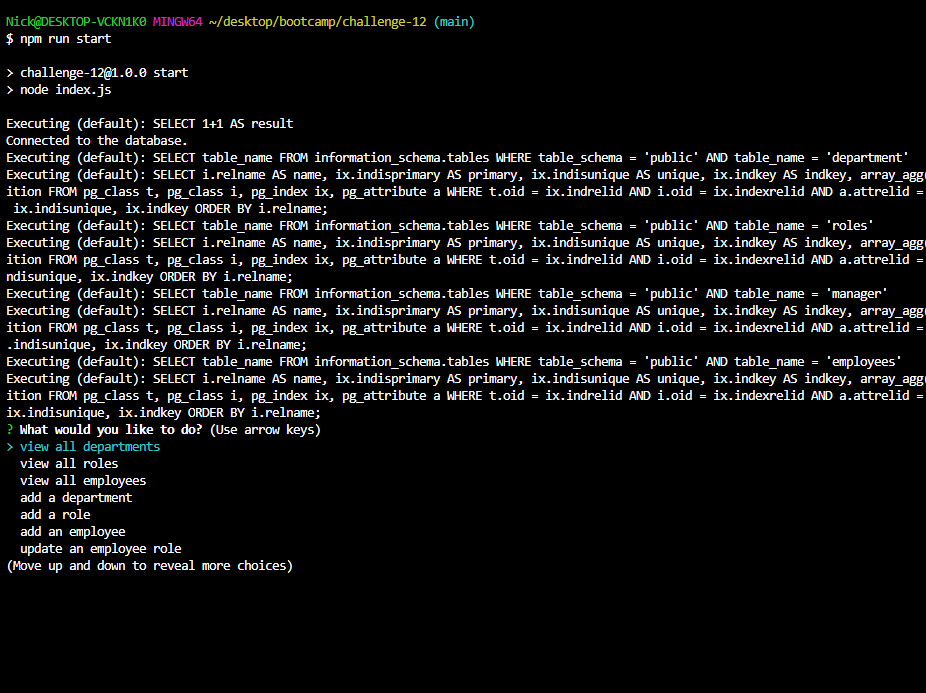

# Employee Tracker

## Table of Contents
* [Description](#description)
* [Installation](#installation)
* [Usage](#usage)
* [License](#license)
* [Contributing](#contributing)

## Description

A CLI designed to keep track of employees by cataloging their department, salary, title, and manager.

## Link to deployed application
 
* Link to Walkthrough Video: https://drive.google.com/file/d/1avoxTuOh6KfskIiwUQJQINyPdbDgB-BR/view
* Link to Github: https://github.com/nramos9071/challenge-12

## Webpage Screenshot

## Installation
Postgres, Sequelize, dotenv, and inquirer. 

To seed type "npm run seed"
To start type "npm run start"

Use arrows to navigate the interface.
 
## Usage
This tracker allows you to view all employees in the system. It also allows you to view all current departments and roles available. It will also allow you to add departments, employees, and roles. It will also allow you to update employees. 
 
## License
N/A
 
## Contributing
Code Created by: Nick Ramos with code contributed by CoPilot.